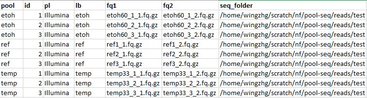

# Usage

## Running on the cluster

Dependencies:

```
module load nextflow
module load fastqc/0.11.9
module load bwa
module load sambamba
module load samtools
module load python
module load picard
module load fastp
```

[grenedalf](https://github.com/lczech/grenedalf)

```
git clone --recursive https://github.com/lczech/grenedalf.git
cd grenedalf
make
```

## Running the workflow

You should run this in a screen session.

```
nextflow run main.nf -cpus <# of cpus> --sample_sheet <path_to_sample_sheet> --species c_elegans -profile quest -resume

Ex:
nextflow run main.nf -cpus 8 --sample_sheet sample_sheet.csv --genome "/home/$USER/scratch/pool-seq/genome/genome.fa" -resume
```

## --sample_sheet

The `sample sheet` has the following columns:

* __pool__ - the name of the pool. Multiple sequencing runs of the same strain are merged together.
* __pl__ - Sequencing technology used to generate the sequencing data. Valid values: ILLUMINA, SOLID, LS454, HELICOS and PACBIO.
* __id__ - A unique ID for each sequencing run. This must be unique for every single pair of FASTQs.
* __lb__ - A library ID. This should uniquely identify a DNA sequencing library.
* __fq1__ - The filename of FASTQ1
* __fq2__ - The filename of FASTQ2
* __seq_folder__ - The path to FASTQ



## TODO list

* Add custom parameters
* Add cluster profile
* Create module containers

